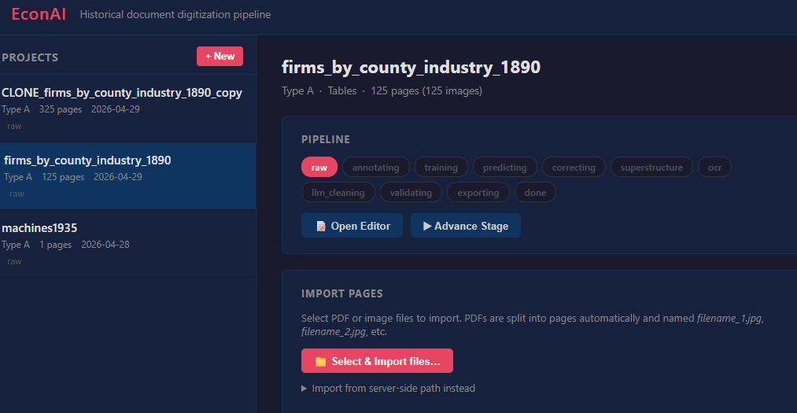
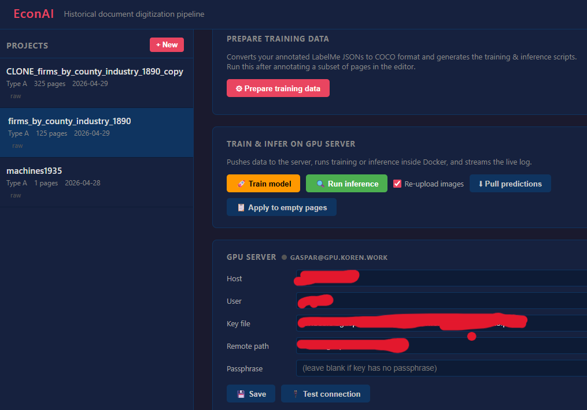
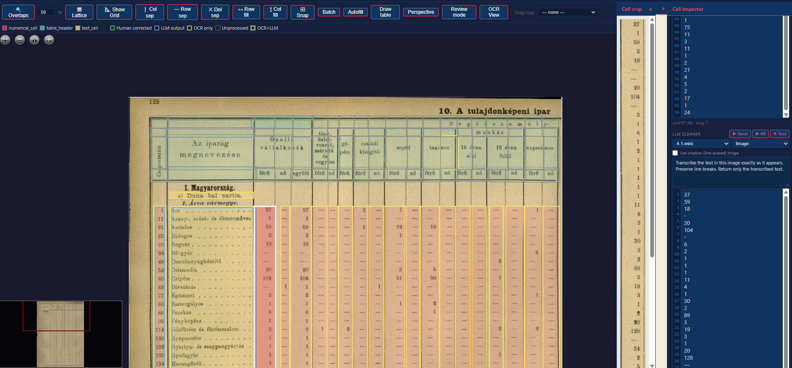

# Dedust — Historical Document Digitization Pipeline

*(working name; formerly "EconAI". The repo may later be renamed — candidate: `hollerith`.)*

A browser-based tool for turning large collections of scanned historical documents (statistical tables, company registers, census pages) into clean, structured data. It combines layout detection, OCR, and LLM-based cleaning, with human-in-the-loop correction at every step.

**What you need:**
- A Windows/Mac/Linux laptop to run the web app
- A GPU server with SSH access (for training the layout model and running inference)
- An OpenAI / Azure OpenAI API key (optional — only for LLM steps)

---

## What's new

Highlights of major additions (newest first). Small fixes aren't listed here.

**2026-07 — fine-tune from corrections (active learning)**
- **⚡ Fine-tune from a source model** — after bootstrapping a project with *Infer from* and hand-correcting the predictions, feed those corrections back: the dashboard's "Feed corrections back" row trains the project's **own** model, warm-started from the source model's weights (`MODEL.WEIGHTS` override) with a short, gentle solver (default 500 iterations, LR 0.00025). The source model is never modified. Loop: infer → correct → fine-tune → re-infer; corrections get cheaper every round.

**2026-07 — remote access + mobile review (Phase A)**
- **🔐 Token-guarded remote access** — set the `ECONAI_TOKEN` environment variable and start with `python econai.py serve --host 0.0.0.0` to make the server reachable beyond your machine. Remote visitors get a login page (token entered once per device); requests from `127.0.0.1` are never restricted, and **without the token set nothing changes at all** — the local workflow is untouched. Authorized remote sessions are additionally **caged to the `projects/` folder** (no arbitrary filesystem paths). Pair it with a Cloudflare Tunnel to reach your home server from anywhere. See [Remote access](#remote-access).
- **📱 Mobile review page (PWA)** — `/static/review.html` is a phone-sized review mode: pick a project, and suspect cells arrive as swipe-through cards (image snippet, best guess pre-filled, numeric keypad) with **✓ Accept / ∅ Blank / ↓ Skip / ↩ Undo**. Installable to the home screen. Review cells on your commute.
- **Shared review endpoint** — desktop strip and mobile page now go through one server endpoint (`POST /api/review/accept`), so review semantics (empty accept = structural blank, exact undo) can never drift between the two.

**2026-07 — review, structure, and cost overhaul**
- **⚡ Review queue** — step through *only* the suspect cells across a whole project (OCR≠LLM disagreements, numeric column outliers, unverified cells), worst-first, in a docked strip: **Enter** accepts the best guess into Human, type to correct, **↓** skip, **U** undo. Optional **🎯 Pinpoint** draws a big arrow on the current cell. A cell with a Human value is considered resolved and never re-appears. See [Review queue](#review-queue).
- **Page status scoreboard** — every page carries a status (`predicted → corrected → verified → problem`); a dropdown in the nav bar and the **V** key (verify + jump to next unverified) set it, and the dashboard shows a per-project **Review progress** bar. See [Page status](#page-status).
- **Structure vs content, separated** — **⊞ Build internal row structure** is now the single place row geometry is decided (free, local): detect rows per cell, *or* project one anchor column's structure across the lattice row; row count from the image or a content layer's line count. Content is then a separate OCR/LLM pass with **Scope = "Internal rows (keep structure)"**. The old *Anchored OCR / Anchored LLM* batch ops are gone (subsumed). See [Build row structure](#build-row-structure).
- **LLM Send × Scope** — the LLM mode is now two choices: **Send** (Image / OCR text / Image+OCR) and **Scope** (Whole annotation / Internal rows: keep structure / re-detect). See [OCR & LLM](#step-9-ocr-and-llm-cleaning).
- **🌙 Overnight LLM batches** — submit a whole project's LLM cleaning to the OpenAI/Azure Batch API at **half price** (done within 24h); live submit progress, auto-split under the 200 MB file limit, per-job Apply/Cancel/Remove. See [Overnight batches](#overnight-llm-batches).
- **Faster & cheaper live LLM** — batch LLM runs several requests in parallel, and identical requests are served from a local response cache (re-runs are free).
- **🚫 Structural blanks** — a free ink scan marks cells that are blank by design; batches skip them and export emits them as missing (not a dash). Mark/un-mark by hand with **B**. See [Structural blanks](#structural-blanks).
- **🏛 Authority resolver** — resolve OCR'd strings to canonical entity IDs (places, industries) at annotation time, per cell / per column / in batch, with an **unresolved-strings worklist** (fix once, apply everywhere) and confirmed-alias promotion. See [Authority resolver](#authority-resolver).
- **🧩 Structured (JSON) extraction** — one annotation → a schema-conforming JSON record, with a per-project schema editor and a JSON export op. See [Structured extraction](#structured-json-extraction).
- **Command palette (Ctrl+K)** and a **?** shortcut cheatsheet; batch **recipes**, **👁 Preview**, and one-step **batch undo**.

---

## Screenshots

### Project dashboard





### Annotation editor



---

## How it works

The pipeline takes you from raw scanned pages to a clean Excel/CSV file:

```
(1) Import pages → (2) Annotate layout → (3) Train GPU model → (4) Run inference
→ (5) Correct predictions → (6) Detect table structure → (7) OCR cells
→ (8) LLM cleaning → (9) Validate → (10) Export
```

Two document types are supported:
- **Type A** — tables (statistical yearbooks, census counts): the tool detects a grid layout
- **Type B** — structured text (company registers, directories): the tool extracts fields via LLM

---

## Setup

### 1. Install Python

You need Python 3.10 or later. Check with:
```bash
python --version
```
If you don't have it, download from [python.org](https://www.python.org/downloads/).

### 2. Clone the repository

```bash
git clone https://github.com/attilagaspar/econai-dedust.git
cd econai-dedust
```

### 3. Install Python dependencies

```bash
pip install -r requirements.txt
```

This installs the web server, image processing libraries, OCR engines, and SSH tools.

> **Tip:** If you want an isolated environment (recommended), create a virtual environment first:
> ```bash
> python -m venv .venv
> .venv\Scripts\activate      # Windows
> source .venv/bin/activate   # Mac/Linux
> pip install -r requirements.txt
> ```

### 4. Install Tesseract (OCR binary)

Tesseract is an OCR engine that needs to be installed separately from Python.

- **Windows:** Download and run the installer from [UB Mannheim](https://github.com/UB-Mannheim/tesseract/wiki). During install, tick "Add to PATH".
- **Mac:** `brew install tesseract`
- **Linux:** `sudo apt install tesseract-ocr`

### 5. Start the app

```bash
python econai.py serve
```

This starts a local web server and prints a URL. Open it in your browser (usually `http://localhost:8000`). Keep this terminal open while you work — closing it stops the server.

---

## First-time workflow

### Step 1: Create a project

On the dashboard, click **+ New**. Give it a name (e.g., `machines1935`), choose the document type (A for tables, B for text), and enter the label names that describe what's on the page (e.g., `table header figure`).

### Step 2: Import pages

In the project detail panel, click **Select & Import files…** and choose your PDF or image files. PDFs are automatically split into individual pages. Pages are stored in the project's `annotations/` folder.

### Step 3: Annotate a sample

Click **Open Editor** to open the annotation editor. Draw bounding boxes around the regions you care about (tables, headers, figures) and assign labels. You only need to annotate a sample — typically 20–50 pages is enough to train a good model.

See the [Editor section](#annotation-editor) below for keyboard shortcuts.

### Step 4: Configure the GPU server

In the **GPU Server** card on the dashboard, fill in:
- **Host** — the server's address (e.g., `gpu.university.edu`)
- **User** — your SSH username
- **Key file** — the full path to your SSH private key (e.g., `C:\Users\you\.ssh\id_rsa`)
- **Remote path** — a folder on the server where data will be stored (e.g., `/home/you/econai`)

Click **Save**, then **Test connection** to verify it works.

### Step 5: Set up Docker containers on the server

In the **Docker Containers** card, enter names for the predict and train containers (or leave the defaults). Click **Check status** to see if they already exist. If not, click **Build** — this uploads the Dockerfile and compiles everything on the server (takes 10–30 minutes the first time).

### Step 6: Train the layout model

Click **Prepare training data** (converts your annotations to the format Detectron2 expects), then **Train model**. A live log will stream in a popup. Training typically takes 30–90 minutes.

### Step 7: Run inference

Click **Run inference** to apply the trained model to all your pages. This uploads the images and runs the model in Docker on the GPU server. When done, click **Pull predictions** to download the results.

### Step 8: Correct predictions

Open the editor and check the predicted boxes. Fix any mistakes, adjust boundaries, and assign correct labels. Use **Apply to empty pages** on the dashboard to seed uncorrected pages with the model's predictions before you start.

### Step 9: OCR and LLM cleaning

Once the layout is correct, run OCR on each cell (or batch-process all pages), then LLM cleaning to normalize numbers, fix OCR errors, or extract fields. LLM steps use OpenAI or Azure OpenAI; keys come from environment variables (`OPENAI_API_KEY`, or `AZURE_OPENAI_ENDPOINT` + `AZURE_OPENAI_API_KEY`).

The LLM panel and the Batch LLM op both offer two independent choices:
- **Send** — what the model sees: `Image`, `OCR text`, or `Image + OCR`.
- **Scope** — what one request covers: `Whole annotation`, `Internal rows (keep structure)` (reads into each cell's existing row bands), or `Internal rows (re-detect)`.

Working per internal row records/uses each cell's **internal row structure** — where every text row sits, with the OCR / LLM / Human readings stored side by side per row (see [Internal row structure](#internal-row-structure)). The model dropdown includes the GPT-5 family and o-series reasoning models (calls adapt automatically); you can also define [**row rules**](#row-rules-validation-between-columns) that arithmetic-check columns and let the LLM propose fixes. For big or overnight jobs see [Overnight batches](#overnight-llm-batches); to run cheap models cheaply, live Batch LLM parallelizes requests and caches identical ones.

### Step 10: Export

Click **Export** in the editor toolbar. This generates an `.xlsx` file preserving the table structure, one row per text line in each cell. Cells with an internal row structure export one Excel row per internal row, with the chosen content layer (e.g. Human > LLM > OCR > PDF) applied per row.

Export options include: a **page pattern** of `1`/`0`s controlling how pages tile onto the sheet (blank = each page stacked vertically; `1,1` = pairs side by side; `1,0` = odd pages only; any 1/0 cycle works), with side-by-side pages aligned rank-by-rank on their printed lattice rows; a 1-indexed range-aware **column filter** (`3`, `2-4`, `3-`, `-5`, `1,3,5`) that still keeps free (non-lattice) annotations; an optional **Clip column**; and filters for "only cells with an internal row structure" / "only rows that have a clip". Cells marked as [structural blanks](#structural-blanks) export as empty. When authorities or structured records are present, companion **Resolved** and **Structured** sheets are added.

---

## Annotation editor

Open with **Open Editor** on the dashboard, or navigate directly to `/static/index.html`.

### Navigation
| Action | How |
|---|---|
| Pan | Click-drag on empty canvas (when not in draw mode) |
| Zoom | Scroll wheel |
| Previous / next page | **M** / **N** |
| Navigate lattice cells | ← → ↑ ↓ arrow keys (when a lattice cell is selected) |
| Toggle edit / review mode | **E** |

### Drawing boxes
| Action | How |
|---|---|
| Draw a box | Click-drag on empty canvas (in draw mode) |
| Draw a full table | Draw the outline, then add column and row separators using the toolbar |
| Select a box | Click it |
| Rubber-band select | Ctrl+drag on empty canvas — selects all boxes in the rectangle |
| Add to selection | Ctrl+click |

### Editing boxes
| Action | How |
|---|---|
| Move | Drag the box |
| Copy to a new position | Right-drag |
| Clone flush-adjacent | Ctrl + arrow key (fills a grid fast) |
| Delete | Delete key |
| Change label | Use the dropdown in the right panel |
| Undo | Ctrl+Z (up to 50 steps) |

### Copy-pasting across pages
| Action | How |
|---|---|
| Copy selection | Ctrl+C |
| Paste (offset by 10px) | Ctrl+V |
| Stamp onto previous page | **P** |
| Stamp 2 pages back | **O** |

Stamping is useful when many pages share the same table structure — annotate one page fully, then stamp to neighbours.

### Lattice (table grid) tools

Once you have a rough layout, the lattice tools let you define the precise grid:

| Tool | What it does |
|---|---|
| **Lattice** | Auto-detect the row/column grid from existing boxes |
| **Show Grid** | Toggle the blue grid overlay |
| **Col sep / Row sep** | Click inside the grid to split a column or row |
| **Del sep** | Click a separator to merge the adjacent columns/rows |
| **Snap** | Snap all cells to the exact grid boundaries |
| **Row fill / Col fill** | Propagate a label across a whole row or column |

### Internal row structure

Each annotation can carry an **internal row structure** (`row_struct` in the JSON): the bounding band of every text row inside the cell, numbered 1…N, with the OCR, LLM and Human content stored **per row, side by side**. One structure per cell — the layers share it. Old JSONs without it load unchanged, and the flat text fields are always kept in sync, so everything downstream (export, diagnostics, batch conditions) works either way.

| Feature | Where |
|---|---|
| Structures are created automatically | Any per-internal-row OCR/LLM run |
| Convert one legacy cell | **⊞ Convert** in the right panel (best layer's line count + histogram split) |
| Build in bulk | Batch op **⊞ Build internal row structure** (see [below](#build-row-structure)) |
| Table view | Selecting a structured cell shows `# · crop · PDF · OCR · LLM · Human`; green = layers agree, red = conflict; Human editable inline |
| Copy to Human | Click any PDF/OCR/LLM value (one row) or **⤓H** in a header (whole column) |
| Majority vote | **⚖** fills Human where the sources agree (2-of-3 rule) |
| **⟳ Redistribute** | Per column — reflow the existing flat text (or Human) into the current row bands, one line per row. No re-running, no API cost. Use after editing the structure. |
| **🔍 Re-run** | Per OCR/LLM column — re-run line-by-line extraction over the current bands (LLM button toggles to ■ to stop) |
| Edit dividers | Edit mode, on the cell crop: drag a divider; double-click a (red-highlighted) divider = merge; double-click a band = split |

Dividers are always visible (dashed lines on the page, bands on the crop). Moving or resizing a box rescales its rows proportionally. See [WHATS_NEW_INTERNAL_ROWS.md](WHATS_NEW_INTERNAL_ROWS.md) for a hands-on guide.

### Build row structure

The batch op **⊞ Build internal row structure (detect / anchor-project)** is the one place row geometry is decided — free, local, no API. Then extract content separately with OCR/LLM at **Scope = "Internal rows (keep structure)"**.

| Control | What it does |
|---|---|
| **Rows from** | `Image only` (auto-detect the row count from pixels); a content layer (`Best / Human / LLM / OCR / PDF`) whose line count fixes the number of rows; or **`Existing structure`** — use the anchor cell's own hand-made `row_struct` bands **verbatim** (only meaningful with an anchor pattern) |
| **Anchor column pattern** | *Blank* → detect rows independently in every cell. Otherwise a cyclic per-page list of the anchor `super_column`; its structure is **projected** onto the other columns of the same lattice row. An empty slot skips that page — e.g. `8,,2,1` |
| **Overwrite** | Rebuild cells that already have a structure |

**To propagate one column's structure everywhere:** perfect that column's dividers by hand, then run with **Rows from = Existing structure**, **Anchor column pattern = its column number** (e.g. `2`), pages and column filter blank, Overwrite off. Its exact bands are mapped onto every other column of each lattice row, on every page; the anchor cell itself is left untouched. (Projection is per lattice row, so the anchor column needs a structure in each row you want covered.)

This replaced the former *Anchored OCR / Anchored LLM* batch ops (which mixed structure and content in one paid pass). A single-cell "Anchored" scope still exists in the LLM panel for one-offs.

### Row rules (validation between columns)

**⚖ Rules** opens an editor where you define arithmetic rules between lattice columns, e.g. `1+2=4` ("male + female = all workers"). Each rule has a name, a set of **zero characters** (a cell made only of these — any dash, dot, etc. — counts as 0; empty cells are 0 too), and an optional **page pattern** of `1`/`0`s so the rule only applies to certain pages.

Saved rules appear in the **Diagnose** dropdown as `ROW RULE: <name>`, plus an **all rules** option that unions every rule at once. The rule is evaluated **per internal row**, using the best layer per row (Human > LLM > OCR > PDF); anything that isn't a clean number fails. Violating internal rows are shaded red on the page, so you see exactly which line of which cell breaks the rule. Rules are stored per project and survive restarts.

### Rule fix (LLM-assisted correction)

**🛠 Fix rule** lists every violation of the active rule (or of all rules) on the current page. **▶ Ask LLM** sends, for each violating line, the cell image snippets plus the current readings to the LLM and shows proposed corrections as diffs, with a check of whether the proposal actually makes the rule hold (✓) or not (⚠).

| Control | What it does |
|---|---|
| Prompt box | Editable instruction (persisted); the rule and readings are appended automatically |
| Model picker | Its own model dropdown (defaults to the main LLM model) |
| Max lines / request | Chunk size; **1 = one line per request** |
| Per-line checkbox | Only checked lines are written on Apply |
| **✓ Apply checked** | Writes checked lines to the **LLM layer** (flagged 🛠 as rule-fixed), removes them; unchecked lines stay so you can **Ask LLM** again for a fresh attempt |

Accepted fixes go to the LLM layer, never silently to Human — so the Human layer's "a person verified this" guarantee stays intact, and an existing Human value still wins by layer priority. See [WHATS_NEW_RULES_AND_CLIPS.md](WHATS_NEW_RULES_AND_CLIPS.md) for a hands-on guide to rules, fixing and clips.

### Clips (linking the same data unit across pages)

**🚩 Clips** lets you stamp a numbered, colored flag on **any** annotation to mark that it belongs to the same underlying data unit as an annotation on another page — e.g. a record split across a page break, or a firm description linked to its balance table. A tray across the top of the page shows **➕ new** and any **dangling** flags (placed elsewhere, not yet here); drag a flag onto an annotation, or click a flag then click the annotation. Clipped annotations show a colored badge; click a badge (in clip mode) to remove it. Clips export as a column and can filter the Excel output to only clipped rows.

### Review queue

**⚡ Review** builds a project-wide, worst-first to-do list of *suspect* cells so you fix flagged cells instead of scanning every page. Pick the signals — **OCR≠LLM disagreement**, **numeric column outliers**, **unverified** — plus page/column scope. A strip docks at the bottom and walks the queue:

| Key | Action |
|---|---|
| **Enter** | Accept the shown best guess into Human, advance |
| type then Enter | Write your correction into Human, advance |
| **↓** | Skip |
| **U** | Undo the last accept |
| **Esc** | Close |

The canvas follows each item; tick **🎯 Pinpoint** for a big animated arrow + ring on the exact cell (handy when a cell needs real work, e.g. a bad row structure). A cell that has a Human value counts as resolved and won't come back — so accepting is also the one-keystroke "yes, correct" gesture, and progress persists across sessions and reviewers.

### Page status

Every page carries a **status**: `predicted → corrected → verified → problem`. Set it from the dropdown next to the page number, or press **V** to mark the current page verified and jump to the next unverified one. The dashboard shows a per-project **Review progress** bar. Export can warn on unverified pages.

### Structural blanks

Lattice grids create cells that are blank *by design* (e.g. a district-header row over settlement columns). The batch op **🚫 Mark structural blanks** runs a free, local ink scan and flags inkless cells; the condition **"Skip structural blanks"** then keeps OCR/LLM (and their cost) off them, and export emits them as **missing** (not a dash, not a zero). Mark or un-mark a cell (or a whole selection) by hand with **B** (or the **∅** button in the inspector).

### Authority resolver

**🏛 Authority** resolves an OCR'd string to a canonical entity ID from a shared gazetteer (`authorities/*.authority.json` — places, industries, …) *at annotation time*, so different sources join on stable IDs. Resolve a single cell or internal row, a whole lattice column, or in batch across pages (ditto marks inherit the entity above; low-similarity matches are skipped). County/district context per table sharpens matches. The **Unresolved worklist** groups every unresolved string by frequency so you pick the entity once and apply it to all occurrences, and confirmed picks can be promoted into the authority file as aliases. A companion **Resolved** sheet in the Excel export carries the original text + resolved name + ID.

### Structured (JSON) extraction

For non-table documents (e.g. one firm record per annotation): toggle **JSON** on an LLM call and attach a per-project JSON **schema** (`<project>/schemas/*.json`, edited and live-validated in the panel). The LLM returns a schema-conforming object stored on the annotation, editable as text with validity + conformance checks. The Batch **⇩ JSON export** op collects records in reading order across a page range, with per-label modes: **export**, **ignore**, or **propagate forward** (e.g. a country header attached to every following record until the next one). Output is a single JSON array or a zip of per-record files.

### Batch operations

The toolbar's **Batch** button runs operations across many pages at once with page/parity/condition/column filters and a live progress log. Available ops include: overlap removal + lattice correction, **OCR** (engine EasyOCR/Tesseract × Scope whole / internal rows keep / re-detect — mirrors the LLM controls), LLM (live), **🌙 LLM overnight batch**, **⊞ Build internal row structure**, **🏛 Resolve authorities**, **🚫 Mark structural blanks**, **⇩ JSON export**, score-delete, result-clearing, and short-line stripping.

- **Column filter** is 1-indexed and range-aware: `3` = col 3, `2-4` = 2/3/4, `3-` = 3 to end, `-5` = 1 to 5, `1,3,5` = list.
- **Recipes** — save every setting of the dialog as a named recipe (💾) and re-apply it later; per project.
- **👁 Preview** counts exactly what an op would touch (and why cells are skipped) without changing anything.
- **↩ Undo last batch** restores the pages a writing batch modified (snapshotted just before it ran).

### Overnight LLM batches

The Batch op **🌙 LLM — overnight batch (half price)** hands the whole job to the OpenAI / Azure **Batch API**: half price, finished within 24 hours (often sooner). You can close the browser after submitting. It streams live build/upload progress and **auto-splits** a big job into multiple sub-jobs under the provider's 200 MB file limit. Each job appears in a list with its live status and buttons to **⬇ Apply results** (writes them into the pages exactly like the live path), **✕ Cancel** (while running), or **🗑 remove** (finished). Requires an OpenAI or Azure model; Azure needs a **Global Batch** deployment of the model, and a second Azure resource can be reached with an `azure-us:` model prefix (`AZURE_OPENAI_ENDPOINT_US` / `AZURE_OPENAI_API_KEY_US`).

---

## GPU server — what actually happens

When you click **Train** or **Infer**, the app:
1. Converts your annotations to COCO JSON format
2. Uploads images, config, and shell scripts to the server via SFTP
3. SSH's into the server, starts the Docker container, and runs the script inside it
4. Streams the live log back to your browser

Training runs detached (with `nohup`), so you can close the browser and it keeps going. Clicking **Train** again while training is running re-attaches to the live log.

### Docker setup

The `Dockerfile` at the repo root defines the GPU container:
- Base: NVIDIA CUDA 12.1 + Ubuntu 22.04
- Includes: PyTorch (cu121), Detectron2 (from source), pdf2image, pymupdf, layoutparser

If the container doesn't exist yet, the **Build** button in the Docker card handles everything: uploads the Dockerfile, builds the image, and creates the container with the right GPU and volume settings.

---

## File structure

```
econai-dedust/
  econai.py              — CLI entry point
  requirements.txt       — Python dependencies for the web app
  Dockerfile             — GPU container definition (for the server)
  app/
    server.py            — FastAPI backend (all API routes)
    docker_config.py     — Docker container name config (saved to docker_config.json)
    pipeline.py          — Pipeline stage machine
    page_import.py       — PDF/image import
    coco_convert.py      — LabelMe → COCO JSON
    infer_layout.py      — Runs on the GPU server
    ssh_ops.py           — SSH/SFTP helpers
    static/
      dashboard.html     — Project dashboard
      index.html         — Annotation editor
      validator.html     — Data lab / batch cleaning
  projects/
    <name>/
      config.json        — Project type, labels, server settings
      pipeline.json      — Current stage
      annotations/       — Page images + LabelMe JSONs  [not in git]
      intermediate/      — COCO JSON, training scripts  [not in git]
      predictions/       — Model output JSONs           [not in git]
      output/            — Exported Excel/CSV files     [not in git]
```

---

## CLI reference

```bash
python econai.py serve [--port 8000] [--host 127.0.0.1]      # start the web app
python econai.py new-project <name> --type A --labels l1 l2  # create a project
python econai.py list                                          # list all projects
python econai.py status <name>                                 # show pipeline state
python econai.py advance <name>                               # move to next stage
python econai.py set-stage <name> <stage>                     # set stage manually
python econai.py push-project <name>                           # upload a project to a remote Dedust server (SFTP)
```

**`push-project`** is the fast path for getting data onto a cloud/server deployment: import and render PDFs *locally* (your CPU is faster and browser uploads are size-capped by Cloudflare), then push the resulting files straight up over SSH. Incremental — re-pushing skips unchanged files. First use needs `--host --user --key --remote-projects` (e.g. `/home/dedust/dedust/projects`); they're remembered in `~/.dedust_push.json` afterwards. `--as-name` uploads under a different remote name; `--all` includes `intermediate/` and `output/`. Remember the one-home rule: once you work on a project remotely, stop editing the local copy.

---

## Remote access

By default the server only listens on `127.0.0.1` and nothing is protected — that is the normal single-user local mode and it never changes.

To reach the server from other devices (a phone on your Wi-Fi, or the internet via a tunnel):

```bash
# 1. Set a long random token (this ARMS the guard — without it, remote binding is refused)
set ECONAI_TOKEN=some-long-random-string        # Windows
export ECONAI_TOKEN=some-long-random-string     # Mac/Linux

# 2. Bind beyond localhost
python econai.py serve --host 0.0.0.0 --port 8000
```

What the guard does when the token is set:

| Request origin | Behavior |
|---|---|
| `127.0.0.1` / `::1` | untouched — full local access, no token needed |
| Remote, no token | API calls get `401`; pages redirect to a **login page** (token entered once per device, remembered as a cookie for 30 days) |
| Remote, valid token | works — but the `folder` parameter is **caged to `projects/`**; any path outside it is rejected with `403` |

The token is accepted as a `Bearer` header, an `X-Econai-Token` header, the login cookie, or a `?token=` query parameter.

**Mobile review** — open `/static/review.html` on a phone: a card-based review mode (project picker → suspect cells one at a time with an image snippet, numeric keypad, ✓ Accept / ∅ Blank / ↓ Skip / ↩ Undo). It is a PWA: served over HTTPS (e.g. through a Cloudflare Tunnel) it can be installed to the home screen. Accepting an empty value marks the cell a structural blank — same semantics as the desktop strip, enforced by the shared `POST /api/review/accept` endpoint.

For internet exposure use a **Cloudflare Tunnel** on your own domain (no open ports on your router, HTTPS for free, optional Google-login gate via Cloudflare Access) — see `knowledge_base/08_remote_and_collaboration.md` for the full setup.

### Run in Docker (production / server deployments)

For an always-on deployment (a VPS, an Azure VM), the webapp ships as a container — [Dockerfile.web](Dockerfile.web) + [docker-compose.yml](docker-compose.yml):

```bash
ECONAI_TOKEN=<long random string> docker compose up -d --build          # webapp on :8000
# with the Cloudflare tunnel as a sibling container:
TUNNEL_TOKEN=<connector token> ECONAI_TOKEN=... docker compose --profile tunnel up -d
```

`projects/` and `authorities/` are bind-mounted (data lives on the host), the LLM cache and EasyOCR model weights persist in named volumes, and `~/.ssh` is mounted read-only for GPU-server operations (project `key_path` should point at `/root/.ssh/<keyfile>`). Inside Docker **every request looks remote**, so the token is always required — the compose file refuses to start without one. Local development keeps using `python econai.py serve` directly (unguarded on localhost); the container is the production shape. Deploying updates: `git pull && docker compose up -d --build`.

---

## Pipeline stages

**Type A (tables):**
`raw → annotating → training → predicting → correcting → superstructure → ocr → llm_cleaning → validating → exporting → done`

**Type B (structured text):**
same, without the `superstructure` step

---

## Keyboard shortcuts (annotation editor)

### Page navigation
| Key | Action |
|---|---|
| **N** | Next page |
| **M** | Previous page |

### Lattice cell navigation
| Key | Action |
|---|---|
| **→** | Move selection to the cell to the right (same lattice row) |
| **←** | Move selection to the cell to the left (same lattice row) |
| **↓** | Move selection to the cell below (same lattice column) |
| **↑** | Move selection to the cell above (same lattice column) |

Arrow keys only move within the lattice. If no lattice cell is selected, or there is no neighbour in that direction, the key does nothing.

### Editing
| Key | Action |
|---|---|
| **E** | Toggle edit / review mode |
| **A** | Select all shapes on the page |
| **Delete** / **Backspace** | Delete selected shape(s) |
| **Ctrl+Z** | Undo (up to 50 steps) |
| **Ctrl+S** | Save human correction |
| **Ctrl+C** | Copy selected shape(s) |
| **Ctrl+V** | Paste (offset by 10 px) |
| **Ctrl + ←/→/↑/↓** | Clone selected shape flush-adjacent in that direction |
| **H** | Focus the Human correction field |
| **B** | Mark / un-mark the selected cell(s) as a structural blank |
| **V** | Verify this page & jump to the next unverified page |

### Stamping across pages
| Key | Action |
|---|---|
| **P** | Stamp selection onto the previous page |
| **O** | Stamp selection 2 pages back |

### Help & modes
| Key | Action |
|---|---|
| **Ctrl+K** | Command palette — every button, searchable |
| **?** | Keyboard-shortcut cheatsheet |
| **Escape** | Close open modal / cancel current drawing mode |
